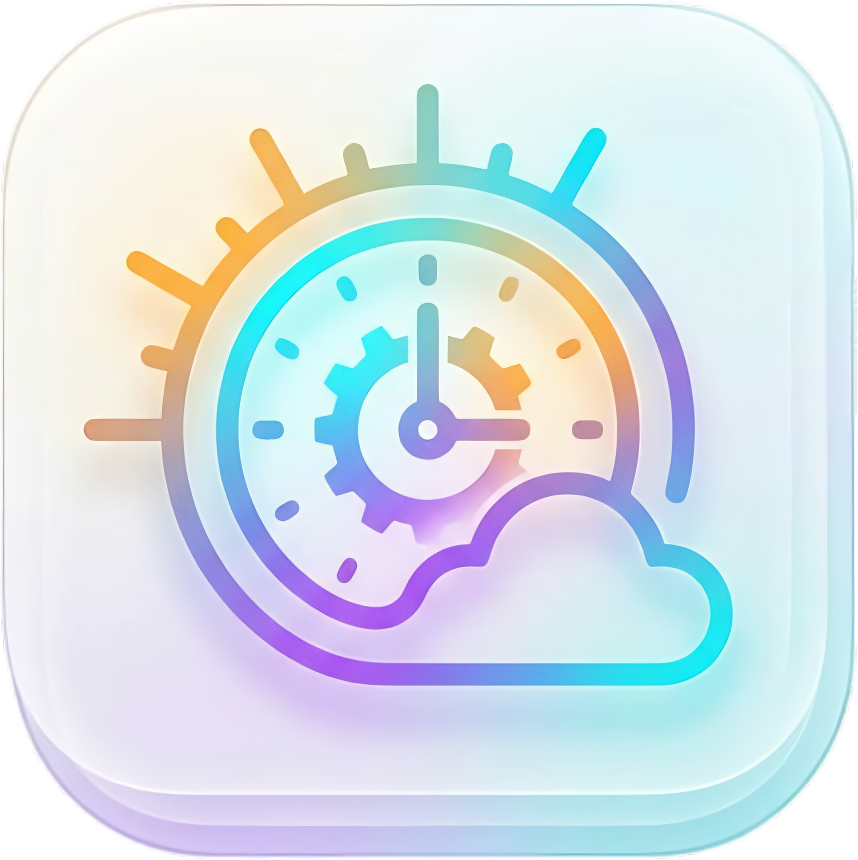
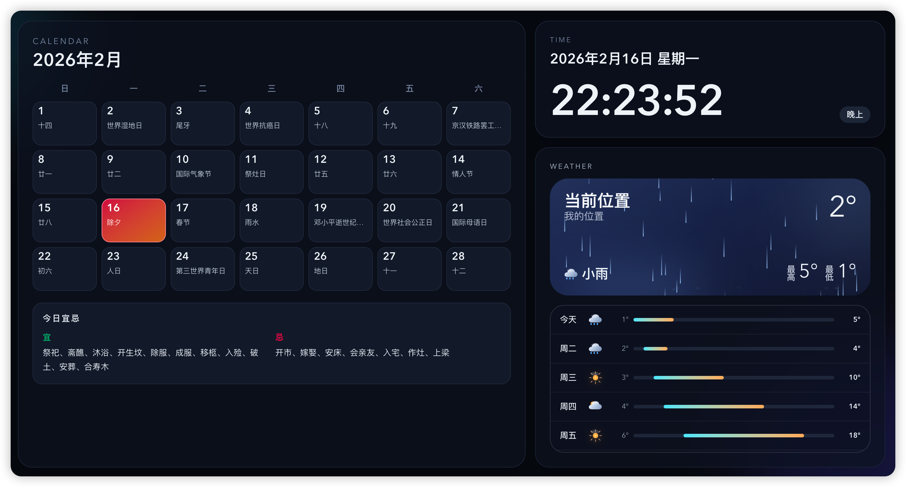
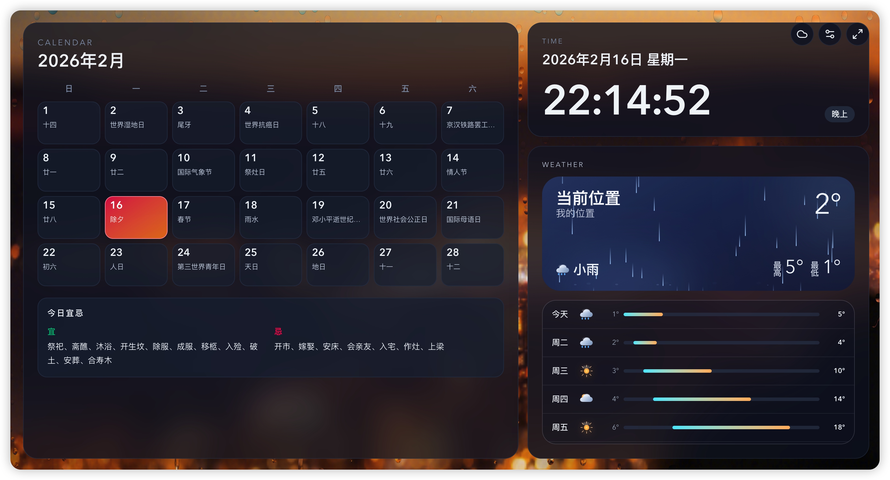

<p align="center">
  
</p>

# Desktop Datetime (桌面时钟天气)

[](LICENSE)


一个现代化、沉浸式且美观的桌面仪表盘应用。它将实时天气可视化、全面的日历系统（包含农历）和可定制的时钟完美融合在一个优雅的界面中。

[在线预览](https://desktop-datetime.pages.dev/)





## ✨ 功能特性

### 🌤️ 沉浸式天气系统
- **动态背景**: 实时渲染的动态背景，让您实时感受天气变化。
- **丰富的天气场景**: 支持晴天、晴夜、多云、雨、雪、雾、雷暴和大风等多种天气状况。
- **详细预报**: 直观展示当前温度、最高/最低温，以及可视化的未来 7 天天气趋势。
- **智能主题**: UI 界面会根据当前的天气状况和时间自动适配颜色和渐变效果。

### 📅 高级日历与时钟
- **农历支持**: 内置农历（阴历）支持，在公历日期旁显示传统农历日期。
- **每日宜忌**: 包含基于传统黄历的每日“宜”与“忌”推荐。
- **实时时钟**: 精确到秒的数字时钟，并带有贴心的时段问候语。

### 🎨 优雅的用户体验
- **毛玻璃设计**: 采用现代化的磨砂玻璃质感设计，配合流畅的模糊效果和充满活力的渐变色。
- **深色/浅色模式**: 可在这个沉浸式的深色模式和温暖明亮的浅色模式之间无缝切换。
- **响应式布局**: 完美适配从移动设备到 4K 桌面显示器的各种屏幕尺寸。
- **全屏体验**: 支持一键切换全屏，打造无干扰的类似 Kiosk 的展示体验。

## 🧱 Workspace 结构

- `apps/web`: 当前 Next.js 前端应用
- `apps/api`: 后端占位目录（后续接入）
- `packages`: 预留共享包目录

## 🚀 开发命令

```bash
pnpm install
pnpm dev
pnpm lint
pnpm build
```

## 📄 许可证

本项目采用 MIT 许可证 - 详情请查看 [LICENSE](LICENSE) 文件。
